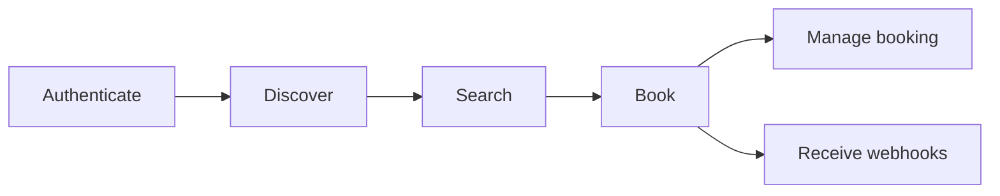

# API Overview

This document describes the core concepts and flow for integrating the Holiday Extras Partner API. It covers each stage of the journey from authentication through to managing bookings, and is the right place to start before diving into individual endpoint guides.

---

## The integration journey



---

## Authenticate

Authentication uses OAuth 2.0 `client_credentials`, which gives you a Bearer token valid for 1 hour. A single token covers all requests during that window - no per-request authentication to manage:

```http
Authorization: Bearer {token}
```

Caching the token and refreshing it on expiry keeps your integration simple. See [02-authentication.md](./02-authentication.md) for the full details.

---

## Discover

`GET /v2/locations` returns the locations available for the product types you request, along with their supported codes, product types, and currencies. Use it to build a location picker and determine which currency to pass in a product search.

The response is stable and cacheable. A daily refresh is enough to stay current without adding unnecessary latency to your searches.

For Airport Parking, request `product_types=parking` and use the returned IATA location codes in your search.

See [get-locations.md](../api-reference/get-locations.md).

---

## Search

Product search endpoints return current availability and pricing for the customer's location and dates. Detailed search endpoints also return localised product content in the same response. Alternatively, separate search and content endpoints let you cache content independently.

Each search result includes a `product_token` that carries the selected product, dates, currency, and quoted price into booking. The exact endpoint path depends on the product.

For Airport Parking, `GET /v2/products/parking/detailed` returns availability, pricing, and content together. `GET /v2/products/parking` returns availability and pricing without product content. Both endpoints return Price Lock details for every result.

See [Search endpoints](./04-search-endpoints.md), [Search parking with content](../api-reference/get-parking-availability-detailed.md), [Search parking](../api-reference/get-parking-availability.md), and [Price Lock](./07-price-lock.md).

---

## Language, currency and market

Use `accept-language` to request product and booking content in the customer's language. Use `country_codes` on `GET /v2/locations` when you only want locations for specific markets.

Prices are returned in the currency you request, where that currency is supported for the selected product and location. The API currently supports `GBP` and `EUR`. If your customer journey uses another display currency, your integration can convert the price before showing it to the customer.

---

## Book

Booking endpoints create a booking using the `product_token` returned by search. The response includes a `booking_reference` that you can use to retrieve the full booking details. Endpoint paths are product-specific.

For Airport Parking, use `POST /v2/bookings/parking` to create the booking and `GET /v2/bookings/parking/{ref}` to retrieve it. `price_lock_valid_until` shows how long the selected price is protected, while `product_token_valid_until` controls how long the token can be submitted. See [Price Lock](./07-price-lock.md) for how they work together.

---

## Manage booking

Products that support self-service amendments and cancellations use a two-step quote-then-confirm flow. The quote step lets customers see what they will be charged or refunded before committing.

For Airport Parking, use these endpoints:

```
PATCH  /v2/bookings/parking/{ref}/amendments/quote    → preview the change and receive an amendment token
POST   /v2/bookings/parking/{ref}/amendments/confirm  → apply the change using the amendment token

GET    /v2/bookings/parking/{ref}/cancellations/quote → preview the refund and receive a cancellation token
POST   /v2/bookings/parking/{ref}/cancellations/confirm → cancel using the cancellation token
```

The tokens returned by each quote step are valid for a short window, giving the customer time to review before confirming.

---

## Integration patterns to use across endpoints

The Partner API has a few repeatable patterns that help keep your integration fast, current, and safe to retry.

- **Cache locations daily.** `GET /v2/locations` is stable enough to cache and refresh once a day. Use it to power location pickers and identify supported products and currencies before search.
- **Cache product content by product code and language.** When a product offers a separate content endpoint, cache names, descriptions, images, directions, and facilities by product code and `accept-language`. Content changes less often than price and availability. For Airport Parking, use `GET /v2/content/parking`.
- **Search fresh for each customer journey.** Search responses include availability, price, product requirements, and policies for the customer's exact dates, location, and currency. Treat these as journey-specific rather than cached content. Airport Parking searches also return Price Lock details.
- **Use one idempotency key for each write action.** If a booking, amendment confirmation, or cancellation confirmation times out, resend the same request with the same `Idempotency-Key`. If the customer makes a different choice, send the new request with a new key.
- **Use webhooks for post-booking changes.** For supplier fulfilment, access-method, or booking-impact updates after checkout, use `booking.impacted` webhooks as the prompt to refetch the booking rather than polling every booking on a fixed schedule.

For endpoint-specific error handling, see [Error handling](../errors.md). For webhook delivery and retry behaviour, see [05-webhooks.md](./05-webhooks.md).

---

## Receive webhooks

Holiday Extras can send `booking.impacted` webhooks when a booking changes after it has been created.

Webhooks are useful when your integration needs to keep post-booking journeys up to date, such as customer dashboards, reminder emails, or operational notifications. The webhook tells you which booking changed; your integration can then fetch the latest state using the relevant product booking endpoint.

For Airport Parking, refetch `GET /v2/bookings/parking/{ref}`.

See [05-webhooks.md](./05-webhooks.md).

---

## Handle errors

Endpoint reference pages list the status codes each endpoint can return. For guidance on what your integration should do with those errors - including validation messages, retries, idempotency conflicts, expired tokens, and support diagnostics - see [Error handling](../errors.md).

---

Next: [Authentication](./02-authentication.md)
