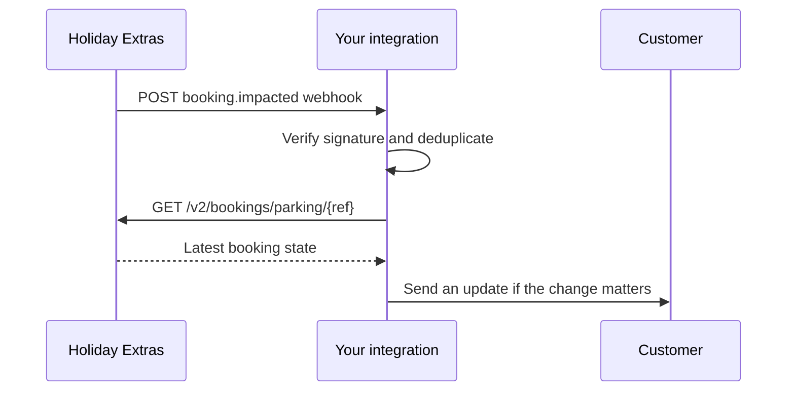

# Webhooks

Webhooks let Holiday Extras keep you updated when a parking booking changes after it has been created. They are designed as a lightweight signal: the webhook tells you which booking changed, then your integration fetches the latest booking state from the Partner API.

Use webhooks for post-booking customer journeys such as reminder emails, customer dashboards, operational alerts, or re-syncing an order in your own platform.

---

## How webhooks fit into the booking journey



The webhook is not a replacement for the view-booking endpoint. It does not contain the full booking, and it does not describe the exact field-level change.

---

## Getting webhooks enabled

Webhooks are configured by Holiday Extras during partner onboarding.

Send your Holiday Extras partner contact:

- The HTTPS endpoint URL that will receive webhook requests
- The environments you want enabled, such as staging or production
- A technical contact for delivery or signature issues

Each environment has its own endpoint configuration and signing secret. Treat staging and production secrets separately.

Set your endpoint up to accept `POST` requests with a JSON body and return a `2xx` response once the webhook has been queued or stored for processing.

---

## Event type

Parking booking-impact notifications use this event type:

| Event type | When it is sent |
|---|---|
| `booking.impacted` | A booking has changed in a way that may affect fulfilment, customer access, customer details, booked units, product details, or booking state |

A `booking.impacted` event can be raised after changes from a few different parts of the journey. Some changes usually follow requests made by your integration, such as an amendment confirmed by your customer. Others happen as Holiday Extras or the supplier continue processing the booking.

| Where the change usually originates | Examples | What to do |
|---|---|---|
| Requests made by your integration | Parking dates changing, customer vehicle details changing, booking contact details changing | Refetch the booking if you need the latest Partner API response for your own journey |
| Holiday Extras or supplier processing | Fulfilment status changing, supplier barcode or reference details changing, booked unit details changing, product code, type, or name changing | Refetch the booking and check whether your customer needs updated access or trip information |

For customer-facing parking journeys, the most useful signal is often that access details or fulfilment state may have changed. On receipt, refetch the booking and compare the latest fields with what you already hold. You do not need to notify the customer for every event; use the latest booking state to decide whether anything customer-facing has changed.

---

## Payload

Example `booking.impacted` payload:

```json
{
  "event_id": "evt_018f5f62-2b7e-7a0b-9a7e-0f5e6f4f9c20",
  "event_type": "booking.impacted",
  "emitted_at": "2026-06-01T10:30:00.000Z",
  "schema_version": "2.0.0",
  "correlation_id": "corr_abc123",
  "data": {
    "booking_reference": "GSFWRJ"
  }
}
```

| Field | Type | Description |
|---|---|---|
| `event_id` | string | Stable identifier for this booking-impact event. Use it for idempotency |
| `event_type` | string | Always `booking.impacted` for parking booking-impact notifications |
| `emitted_at` | UTC datetime | When Holiday Extras emitted the event |
| `schema_version` | string | Payload schema version. Current version: `2.0.0` |
| `correlation_id` | string | Identifier useful when investigating a webhook with Holiday Extras support |
| `data.booking_reference` | string | Booking reference to refetch with `GET /v2/bookings/parking/{ref}` |

---

## Headers

Holiday Extras sends these headers with each webhook request:

| Header | Description |
|---|---|
| `Content-Type` | `application/json; charset=utf-8` |
| `Webhook-Id` | Stable webhook event identifier. Use this to deduplicate deliveries |
| `Webhook-Event-Type` | Event type, for example `booking.impacted` |
| `Webhook-Timestamp` | Unix timestamp in seconds, used in signature verification |
| `Webhook-Signature` | HMAC signature over the webhook ID, timestamp, and raw request body |
| `Webhook-Delivery-Id` | Identifier for this delivery attempt. Changes on retry |
| `Correlation-Id` | Identifier useful when investigating a webhook with Holiday Extras support |

`Webhook-Id` stays the same across retries of the same event. `Webhook-Delivery-Id` is different for each delivery attempt.

---

## Signature verification

Holiday Extras webhooks follow the [Standard Webhooks](https://www.standardwebhooks.com/) signing format, so you can use a Standard Webhooks library if one is available for your stack. The steps below show how to verify the signature directly.

Verify every webhook before using its contents.

The `Webhook-Signature` header contains one or more signatures. Each signature has the format:

```text
v1,{base64_hmac_sha256}
```

Your signing secret is issued in the form `whsec_{base64}`, following the Standard Webhooks secret format. The HMAC key is the base64-decoded bytes of the part following the `whsec_` prefix. It is not the secret string itself.

Multiple signatures may be present during signing-secret rotation. When multiple signatures are present, they are separated by spaces. Accept the webhook if any `v1` signature matches the signature you compute from one of your active signing secrets.

To verify a signature:

1. Read the raw request body exactly as received.
2. Derive the HMAC key: remove the `whsec_` prefix from your signing secret and base64-decode the remainder.
3. Build the signed payload as `{Webhook-Id}.{Webhook-Timestamp}.{rawBody}`.
4. Compute an HMAC-SHA256 digest of the signed payload using the key from step 2.
5. Base64-encode the digest.
6. Compare it with the value after `v1,` using a constant-time comparison.

Example in Node.js:

```js
import crypto from 'node:crypto'

function verifyHolidayExtrasWebhook({ id, timestamp, rawBody, signatureHeader, secrets }) {
  const signedPayload = `${id}.${timestamp}.${rawBody}`
  const signatures = signatureHeader.split(' ')
    .filter(Boolean)
    .filter(signature => signature.startsWith('v1,'))
    .map(signature => signature.slice('v1,'.length))

  return secrets.some(secret => {
    const key = Buffer.from(secret.slice('whsec_'.length), 'base64')
    const expected = crypto
      .createHmac('sha256', key)
      .update(signedPayload)
      .digest('base64')

    return signatures.some(received => {
      const expectedBuffer = Buffer.from(expected)
      const receivedBuffer = Buffer.from(received)

      return expectedBuffer.length === receivedBuffer.length
        && crypto.timingSafeEqual(expectedBuffer, receivedBuffer)
    })
  })
}
```


---

## Delivery and retries

Holiday Extras retries webhook delivery when the delivery problem looks temporary.

| Outcome from your endpoint | Holiday Extras behaviour |
|---|---|
| Any `2xx` response | Delivery is treated as successful |
| Network error | Delivery is retried |
| `408 Request Timeout` | Delivery is retried |
| `429 Too Many Requests` | Delivery is retried |
| Any `5xx` response | Delivery is retried |
| Other `4xx` response | Delivery is not retried |

Retries use exponential backoff with jitter, starting at roughly 5 seconds, capped at 2 hours, and attempted for up to 24 hours.

Delivery is at least once, so make your endpoint idempotent:

- Deduplicate using `Webhook-Id`
- Store the latest booking state after refetching
- Expect the same event to arrive more than once
- Expect events for the same booking to arrive close together

Return a `2xx` response once the event has been queued or stored. If your customer notification process is slower, enqueue the work first, then acknowledge the webhook.

---

## Handling a webhook

Recommended handling flow:

1. Capture the raw request body.
2. Verify `Webhook-Signature`.
3. Reject old timestamps according to your replay-window policy. A 5-minute window is a common default.
4. Deduplicate by `Webhook-Id`.
5. Read `data.booking_reference`.
6. Call `GET /v2/bookings/parking/{ref}`.
7. Compare the latest booking state with any booking data you hold.
8. Update your systems and notify the customer only when the change matters.

Fields commonly worth checking after a `booking.impacted` event:

| Field | Why to check it |
|---|---|
| `booking_status` | The booking may have been cancelled |
| `supplier_fulfilment.status` | Supplier fulfilment may have moved to `fulfilled`, or to `failed` if fulfilment could not be completed |
| `supplier_reference` | The supplier may have added or changed their reference |
| `access_methods` | The customer access methods may have changed |
| `product_content.arrival_procedures` / `product_content.departure_procedures` | Operational instructions may have changed |

---

## Testing

Use staging to validate end-to-end webhook behaviour with Holiday Extras before enabling production delivery.

Recommended tests:

- Valid signature is accepted
- Invalid signature is rejected
- Duplicate `Webhook-Id` does not create duplicate processing
- Retry of the same event does not send duplicate customer emails
- `booking.impacted` triggers a refetch of `GET /v2/bookings/parking/{ref}`
- Your customer notification logic only sends messages for customer-relevant changes

---

## Related guides

- [API Overview](./01-api-overview.md)
- [Authentication](./02-authentication.md)
- [Accessing Parking](../user-guides/accessing-parking.md)
- [GET /v2/bookings/parking/{ref}](../api-reference/get-parking-booking.md)

---

Next: [Error handling](../errors.md)
