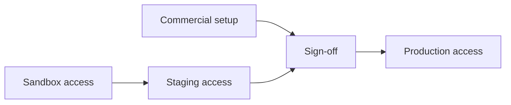

# Getting started with Partner API 2026

This page walks through the onboarding journey from first access to going live. There are four phases: sandbox, staging, sign-off, and production.

Commercial discussions can happen alongside sandbox access. This means your team can explore the API and start building while we confirm the commercial setup, contract route, and launch plan together.

---

## What to prepare

Before or alongside starting your integration, we'll need to confirm a few things on the commercial and technical side.

**Commercial:**
- Company details and primary contact
- Products you plan to offer and intended use case
- Regions and countries of operation
- Commercial agreements or contract route
- Expected go-live date

**Technical:**
- Named technical contact
- Credential recipient for each environment
- Expected API request volumes
- Preferred support channel
- Webhook endpoint details, if you plan to use webhooks

Your Holiday Extras partnerships contact will guide you through these and share a detailed checklist covering where our products will appear in your customer journey and how the integration will work in practice. If you don't have a contact yet, reach out to [partnerconnect@holidayextras.com](mailto:partnerconnect@holidayextras.com).

---

## Phase 1: Sandbox access

**Goal:** Explore the API and check how your integration handles known response scenarios in a safe, predictable environment.

Sandbox uses fake data to return predictable responses. Each scenario has documented values, such as a location code, product code, or booking reference, so you can select the API response you want to test. This includes scenarios that can be difficult to reproduce reliably, such as price changes, unavailable products, specific errors, and product or journey variations.

Use staging to validate the complete end-to-end journey. Staging uses test products and content and connects to supplier test systems, so no real car park is booked.

Sandbox access can be provided while commercial and contract conversations continue.

**What to do:**
1. Contact [partnerconnect@holidayextras.com](mailto:partnerconnect@holidayextras.com) to request your sandbox credentials. We'll provide your `client_id` and securely share your `client_secret` through a single-use link.
2. Work through the [integration guides](./docs/integration-guides/01-api-overview.md) and [API reference](./README.md#airport-parking) to build your integration.
3. If you use webhooks, prepare your endpoint, signature verification, deduplication, and refetch handling using the [Webhooks guide](./docs/integration-guides/05-webhooks.md). Delivery testing happens in staging.
4. Use the [customer journey guide](./docs/user-guides/customer-journey.md), [sandbox testing guide](./docs/integration-guides/03-sandbox-testing.md), and [scenario catalogue](./docs/integration-guides/08-sandbox-scenarios.md) to cover the response scenarios relevant to your integration.

Once you've covered the agreed sandbox scenarios, share the examples listed in the sandbox scenario coverage checklist with your partnerships contact and let them know you're ready to move to staging.

---

## Phase 2: Staging access

**Goal:** Test your complete end-to-end integration across the Holiday Extras staging environment and connected supplier test systems.

Staging uses test products and content and connects to supplier test systems. Use it to validate the complete end-to-end journey without creating a booking at a real car park.

**What to do:**
1. We'll provide your staging credentials once the agreed sandbox scenario coverage is complete and your integration is ready for end-to-end validation across staging and connected supplier test systems.
2. Complete your integration against staging.
3. For each product you're integrating, share example requests and responses with your partnerships contact for review.
4. Provide an example of your booking confirmation for each product category.
5. For parking integrations, show how vehicle registration is collected when required, including any follow-up journey when it is required before travel.
6. Let us know when you're ready for sign-off.

---

## Phase 3: Sign-off

**Goal:** Work together to prepare the integration for a reliable launch and a smooth customer experience.

During sign-off, we'll work alongside you, bringing together your knowledge of your customers and technology with our experience of how Holiday Extras products and systems behave in practice. Together, we'll confirm the technical flows are reliable and fine-tune the journey so customers can choose and book with confidence and find the right information throughout. Sandbox shows how your integration handles known API response scenarios; staging lets us focus on the complete end-to-end journey and the details customers and support teams will rely on in production.

The review covers the key flows:

- Availability search and product display
- Booking creation and booking confirmation delivered to customers correctly
- Vehicle registration collection for parking, where required
- Amendment and cancellation flows, if you support them in your integration
- Manual customer service process for any amendment and cancellation journeys managed outside your integration
- Price change handling
- Webhook handling, if you use webhooks
- Product and journey variations, such as different information requirements or access methods

If anything needs attention, we'll share findings and work through them with you before sign-off is granted.

---

## Phase 4: Production access

**Goal:** Go live.

Once sign-off is complete, we'll provide your production credentials.

**Before you go live, confirm:**
- [ ] Booking confirmation is delivered to customers correctly
- [ ] Prices are displayed correctly (see [Displaying Prices](./docs/user-guides/displaying-prices.md))
- [ ] For parking integrations: vehicle registration collection is in place where required
- [ ] Amendment and cancellation flows work end to end, or a manual customer service process is in place
- [ ] If you use webhooks, your production endpoint is ready and the production signing secret is stored securely
- [ ] Launch monitoring and escalation contacts are agreed
- [ ] Recommended: the hosted confirmation page link is included in your purchase confirmation email, giving customers access to the latest booking details

On launch day, complete a low-volume production booking journey first. Fetch the booking with `GET /v2/bookings/parking/{ref}`, check the customer-facing confirmation, and monitor booking success, error rates, webhook delivery, and customer contact reasons during the first production window.

For the first few days after launch, review search-to-booking conversion, booking failure rates, amendment and cancellation outcomes, webhook delivery, and support contacts about confirmations, missing details, access, or refunds.

---

## Ready to start?

[Import](https://learning.postman.com/docs/design-apis/specifications/import-a-specification) Partner API Connect's [Schema](https://api-staging.holidayextras.com/partner-api/v2/schema.json) into Postman and contact [partnerconnect@holidayextras.com](mailto:partnerconnect@holidayextras.com) to kick things off.
